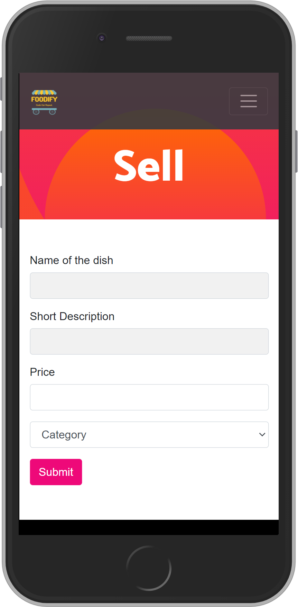
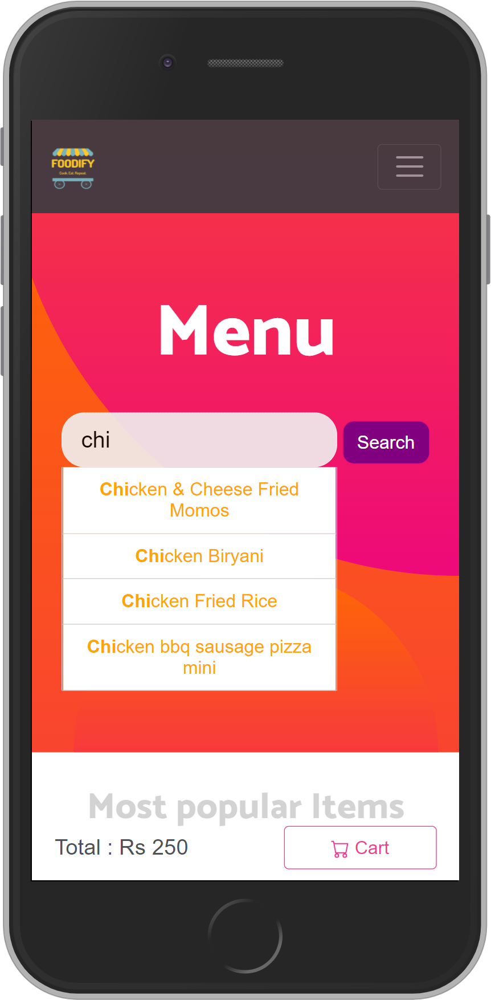
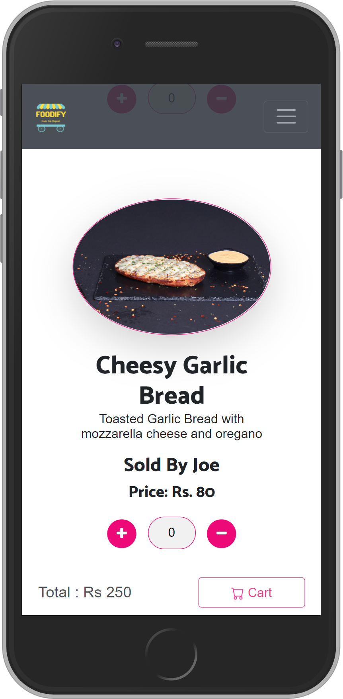
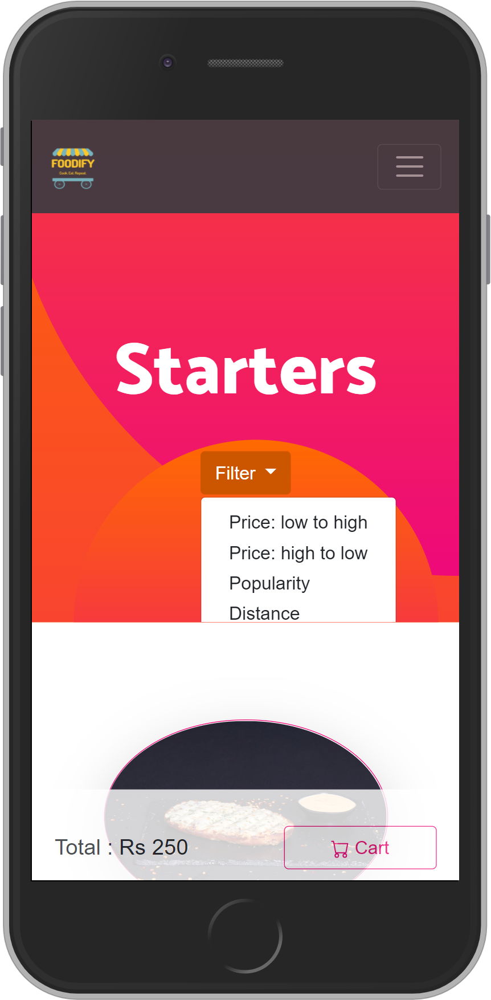
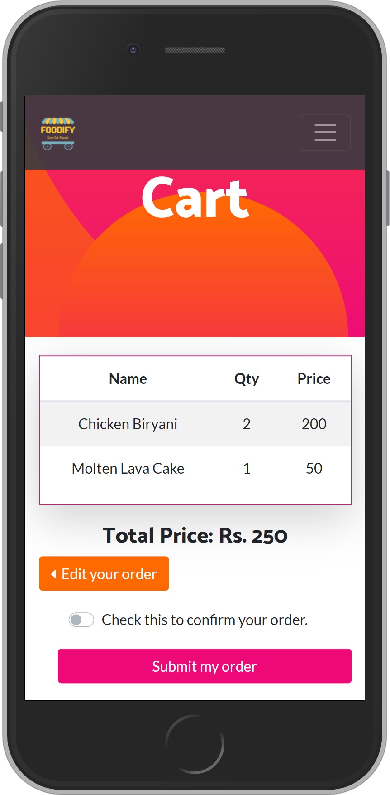
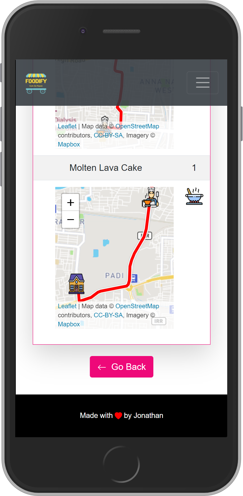
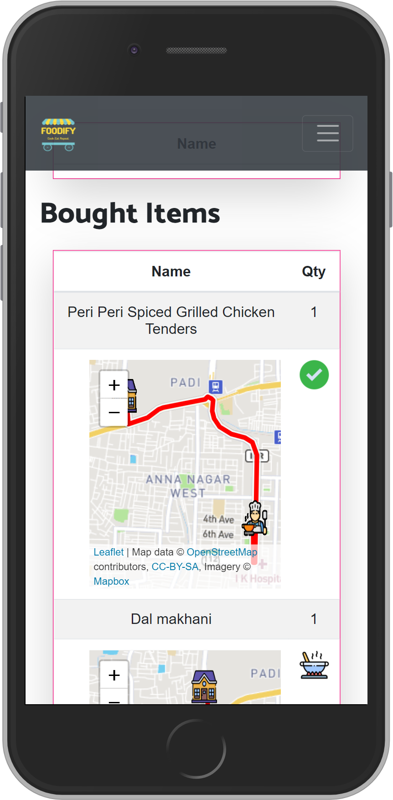
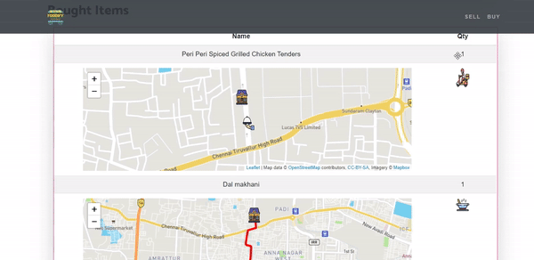

# :pizza: Foodify
A web app to buy and sell food items!

## :tada: Features
* Live status updates
* Live tracking of the delivery agent in the map
* Dynamic cart functianality with the Total Price
* Searching for food items and sellers
* User Verification
* Filters

## :hammer: Built With
* [Node.js](https://nodejs.org/en/)
* [Express.js](https://expressjs.com/)
* [MongoDB](https://www.mongodb.com/)
* [Bootstrap](https://getbootstrap.com/)

## :camera: Screenshots

| **Home Page** | **Login Page** | **Selling Page** |
|----------|-----------|------------|
|  |  |  |

| **Menu Page With Search** | **Menu Page With Items** | **Menu Page With Filters** |
|----------|-----------|------------|
|  |  |  |

| **Cart Page** | **My Account Page When Item is Cooking** | **My Account Page When Item is Delivered** |
|----------|-----------|------------|
|  |  |  |

## :video_camera: Delivery Demo

